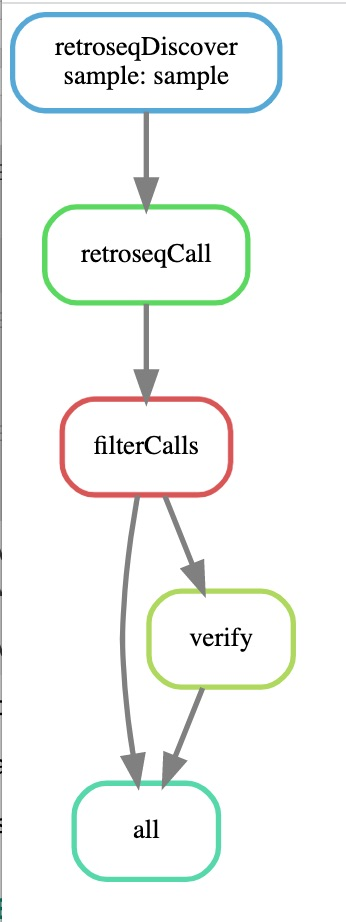

# RetroSnakeSurfSara

This is a SnakeMake pipeline based on RetroSeq https://github.com/tk2/RetroSeq,  a tool for discovery of transposable element variants.
The pipeline runs RetroSeq configured to seach for HERV-K insertions (can look for any other mobile elements, see below how to change that), filters RetroSeq predictions and verifies the insertions by assembling the regions around each insertion and running the assembled contigs through RepeatMasker.

<div align="center">
     
</div>


# Basic Setup
open config.yaml file and update all directories: e.g. CRAM or BAM file path; output directory path; RepeatMasker path; 


## Reference genome
If you already have a reference genome (and it is indexed), update the path to it in config.yaml
If you do not, run the script downloadHG19.sh in order to install it and index it.
```
bash downloadHG19.sh PATH_TO_DIR_TO_PLACE_REFERENCE_GENOME
```
update the path to the newly added and indexed human genome in config.yaml

## Running the pipeline 
Once the paths in config.yaml point to CRAM/BAM path, path to the reference genome and the output path - you can run the pipeline on the provided sample.bam in order to predict insertions, filter them and split them in known and novel.

```
snakemake --use-conda --use-envmodules --cores 1 <MY_OUTPUT_DIRECTORY>{/filter/sample.bed,results/sample.knownHitsF.bed,results/sample.novelHitsF.bed}
```

# Installing Dependencies

## RepeatMasker
https://github.com/rmhubley/RepeatMasker
RepeatMasker is only needed for the verification step.  Without it you can still run RetroSeq, Filter insertions, mark known and novel insertions and run functional annotation. If you do not want the extra verification step, you do not need to install RepeatMasker.

Important:
After the installation of RepeatMasker, update the installation path in the config.yaml file.


# Running the pipeline

As the snakemake pipeline is modular and providing different outputs, one way to call it is to specify the output file.

## Example 1

To produce a file with retroseq prediction which have been filtered and annotated, you would call it:

```
snakemake --use-conda --use-envmodules --cores 1 <MY_OUTPUT_DIRECTORY>/results/<YOUR_SAMPLE_PREFIX>.annotatedFiltered.tsv
```
This would run retroseq, filter the results, and run AnnotSV to annotate them. The prerequisites are that either a <YOUR_SAMPLE_PREFIX>.bam or <YOUR_SAMPLE_PREFIX>.cram exist in the respective bam or cram directories specified in file config.yaml.

To run this on the provided sample.bam, set the bam directory in file config.yaml to Examples, and run:
```
snakemake --use-conda --use-envmodules --cores 1 <MY_OUTPUT_DIRECTORY>/results/sample.annotatedFiltered.{tsv,html}
```

